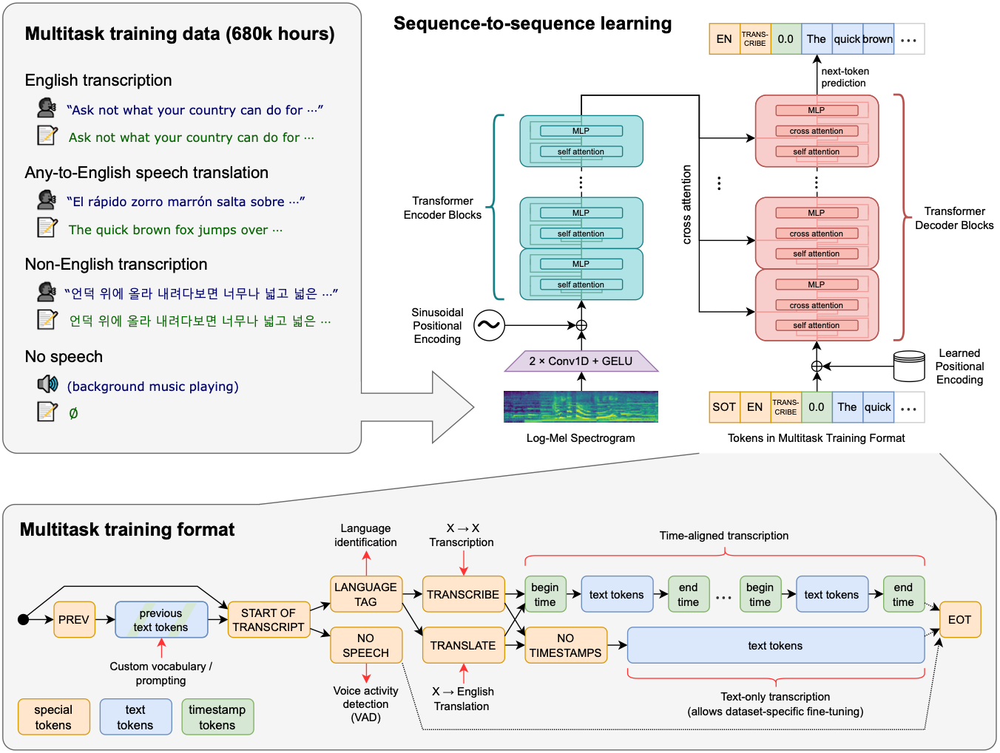

# Whisperapp
This little app showcases how simple it is to use a state-of-the-art machine learning model! 

We are working with OpenAI's Whisper model, a transformer architecture that takes a voice recording as input, splits it into 30 second chunks, converts them into a special kind of spectrogram (by using a Fourier transformation) called Mel spectrogram, infers the language, and then transcribes or even translates the text to english!

The model was trained on 680,000 hours of multilingual and multitask supervised data that was collected from the web! The model is capable of understanding and transcribing in 98 different languages!

Feel free to use this code and extend it to make the app prettier or maybe even implement new features!

> I also have a video on [YouTube video](https://youtu.be/nIEsBcR17oE) where I go talk more about the model and code!